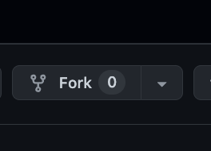
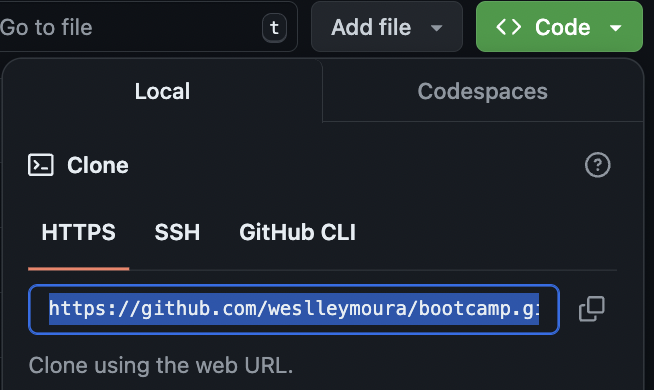

# Bootcamp Data Science / ML Ops

Nesta página você encontrará todas as informações necessárias para acompanhar este bootcamp.

## Pré-requisitos

Antes de começar, você terá que instalar os seguintes softwares na sua máquina:

* [Anaconda](https://www.anaconda.com/download) 
* [Git](https://git-scm.com/book/en/v2/Getting-Started-Installing-Git)
* [PGAdmin](https://www.pgadmin.org/)
* [Docker Desktop](https://www.docker.com/products/docker-desktop/)
* [Python 3.10](https://www.python.org/downloads/)
* [VSCode](https://code.visualstudio.com/)

Como o passo a passo para instalação depende de cada sistema operacional, esta parte fica por conta de vocês. 

Você também precisa criar uma conta no GitHub para acompanhar o projeto. Crie sua conta em [https://github.com/](https://github.com/).

## Criando um ambiente python com conda

Nosso primeiro passo será a criação do nosso ambiente python. Isso é importante, pois é aqui que garantimos que todos os pacotes utilizados no projeto estão instalados.

```conda create -n bootcamputilenv python=3.10```

Uma vez que o ambiente foi criado, devemos ativá-lo.

```conda activate bootcamputilenv```

## Clonando o repositório do projeto

Primeiramente, você deve acessar o repositório original do projeto em https://github.com/weslleymoura/bootcamp e fazer um **fork**. Isso fará com que uma cópia do projeto seja salva na sua própria conta do GitHub (na forma de um novo repositório). 



**Após o fork**, abra o terminal da sua máquina e navegue até o <b>diretório em que deseja salvar o projeto</b> (ao longo do projeto, iremos nos referir a este diretório como <b>woorking dir</b>). 

Em seguida, faça o clone do projeto:

```git clone <<url-do-seu-repositório>>```

Para conseguir a url do seu projeto, acesse o repositório do GitHub que você acabou de fazer o fork (na sua conta to GitHub) e copie o seguinte endereço (HTTPS):



## Instalando as dependências do projeto no seu ambiente python

Note que daqui em diante **você sempre deve manter seu ambiente python ativado**

Acesse o seu **working dir** e digite:

```pip install -r requirements.txt```

## Iniciando o Jupyter Notebook na sua máquina

Acesse o seu **working dir** e digite:

```jupyter lab```

## Iniciando os serviços docker na sua máquina

Acesse o seu **working dir** e digite:

```docker-compose up -d --build```

**APENAS PARA REFERÊNCIA (NÃO É NECESSÁRIO EXECUTAR AGORA):**

* Quando quiser interremper a execução dos serviços, digite: 
```docker-compose down --rmi all --volumes --remove-orphans```

* Se precisar interromper todos os serviços docker em execução na sua máquina, digite:
```docker stop $(docker ps -a -q)```

* Se precisar acessar o container de um dos serviços docker, digite:
```docker exec -it <container_id_or_name> /bin/bash```

* Se precisar executar algo em alguns dos containers (e.g.: container client), digite:
```docker-compose run client /bin/bash```

## Iniciando o corso

Se conseguiu chegar até aqui, então você está pronto para começar nosso curso! Acesse a primeira aula (bootcamp-project-part-1.ipynb) pelo ```jupyter lab```.

## Referências

Segue abaixo algumas referências usadas neste projeto.

* https://plotly.com/python/builtin-colorscales/
* https://dev.to/alexdjulin/my-runing-map-using-python-and-folium-2h2m
* https://github.com/alexdjulin/running-events-map?tab=readme-ov-file
* https://run.alexdjulin.ovh/p/events.html
* https://python-visualization.github.io/folium/latest/user_guide/raster_layers/tiles.html
* https://ayselaydin.medium.com/an-introduction-to-python-fastapi-swagger-ui-fb68d8861fad
* https://github.com/AyselAydin/fastAPI?source=post_page-----fb68d8861fad--------------------------------
* https://stackoverflow.com/questions/31575399/dynamically-add-subplots-in-matplotlib-with-more-than-one-column
* https://stackoverflow.com/questions/12444716/how-do-i-set-the-figure-title-and-axes-labels-font-size
* https://stackoverflow.com/questions/18393498/gitignore-all-the-ds-store-files-in-every-folder-and-subfolder
* https://medium.com/@elton-martins/to-reset-a-git-branch-to-match-the-master-main-branch-6692c28a36fc
* https://docs.github.com/pt/repositories/working-with-files/managing-large-files/installing-git-large-file-storage
* https://stackoverflow.com/questions/76187211/warning-the-ecdsa-host-key-for-github-com-differs-from-the-key-for-the-ip-ad
* https://realpython.com/python-project-documentation-with-mkdocs/
* https://medium.com/@kevinkoech265/a-guide-to-connecting-postgresql-and-pythons-fast-api-from-installation-to-integration-825f875f9f7d
* https://blog.stackademic.com/python-building-simple-api-with-fastapi-and-postgresql-d5ddd7d501b7
* https://medium.com/coding-blocks/creating-user-database-and-adding-access-on-postgresql-8bfcd2f4a91e
* https://medium.com/@sant1/using-minio-with-docker-and-python-cbbad397cb5d
* https://blog.min.io/mlflow-tracking-and-minio/
* https://pandego.medium.com/red-wine-elasticnet-and-dockerized-mlflow-with-postgres-and-minio-d5aee144d1df
* https://github.com/mlflow/mlflow/blob/master/examples/mlflow_artifacts/example.py
* https://safjan.com/deploying-mlflow-on-local-machine-using-docker/#google_vignette
* https://medium.com/@debasishkumardas5/running-github-actions-locally-a-complete-guide-for-windows-mac-and-linux-users-34c45999c7cd
* https://github.com/nektos/act?tab=readme-ov-file
* https://www.freecodecamp.org/news/how-to-run-github-actions-locally/#lists
* https://forums.docker.com/t/docker-no-space-left-on-device/69205/3